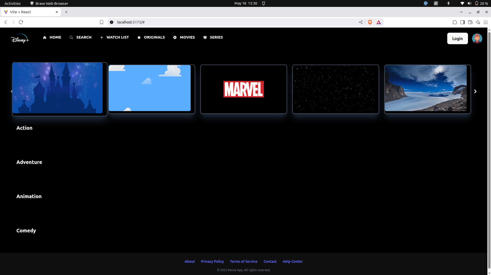
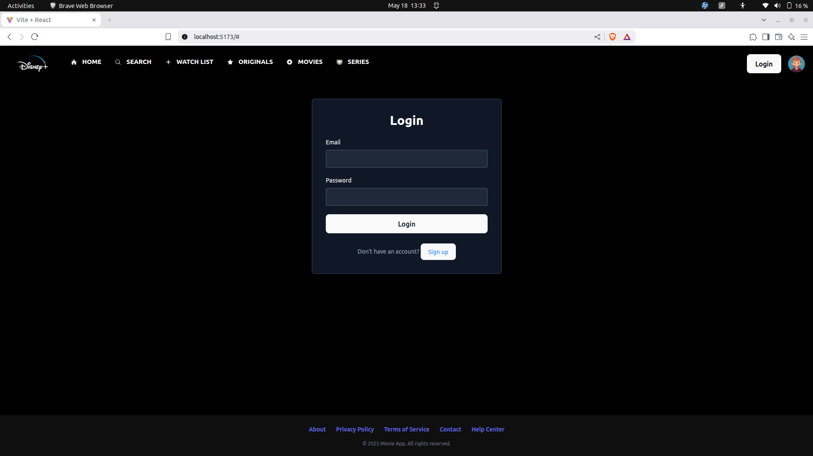
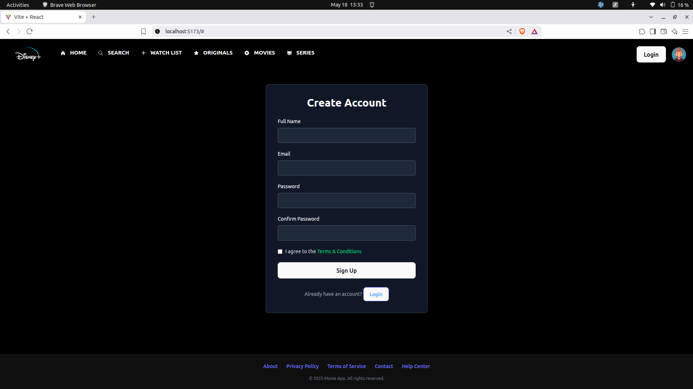

# Movie Exploration Web App

A simple and clean movie browsing app built using **React.js**. Users can explore movies by genres, view featured content, and access login/signup functionality. Styled using **Tailwind CSS**, the app is responsive and works well on both desktop and mobile.

---

## UI Preview

- Home Page with Header, slider, and footer.

- Login Page

- Signup Page

## Features

- **Login & Signup**
  - Login and create an account using simple forms.
  - Signup page includes basic validation and error handling.

- **Home Page**
  - Displays a slider with featured movies.
  - Shows sections for popular genres.
  - Includes production house content.

- **Responsive Header**
  - Navigation bar with menu icons.
  - Dropdown menu on mobile view.
  - Login button and user avatar on the right.

- **Sticky Footer**
  - Footer stays at the bottom of all pages.

---

## Key Components

- `Header.jsx`
  - Navigation menu with icons and login button.
  - Switches between home, login, and signup views.

- `Slider.jsx`
  - Movie slider section to showcase featured content.

- `GenreMovieList.jsx`
  - Displays movies by different genres.

- `ProductionHouse.jsx`
  - Lists content from popular production studios.

- `Login.jsx` & `Signup.jsx`
  - Form-based pages with styled inputs and buttons.

- `Footer.jsx`
  - Simple footer at the bottom of the app.

---

## Project Structure

## Built With

- [React.js](https://reactjs.org/)
- [Tailwind CSS](https://tailwindcss.com/)
- [JavaScript](https://www.w3schools.com/js/default.asp)(ES6)
- [HTML & CSS](https://www.w3schools.com/html/)

